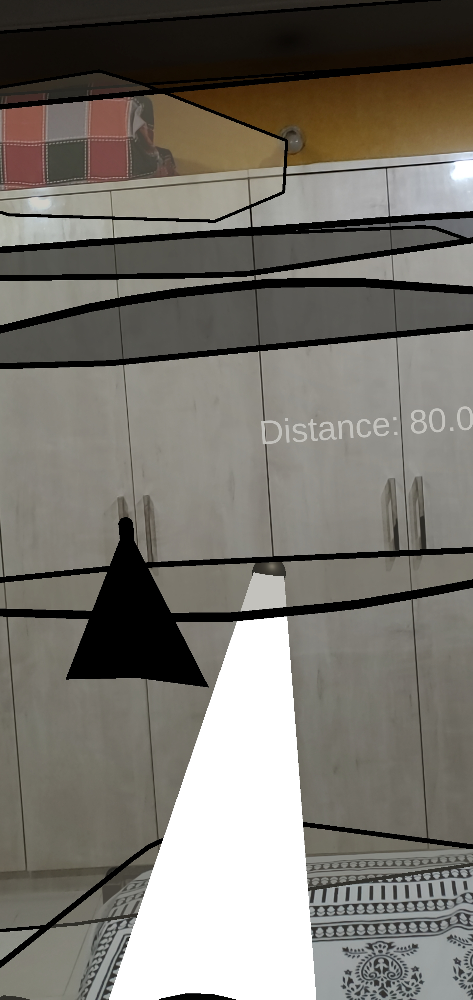

# MeasureDist
 AR Social Distancing App

## Description

This application is an Android AR application which calculates the distance between the user and any object the camera faces; this can be used to maintain a safe distance from others; when the object in question is a human, the spread of the coronavirus from this person can be visualized using particle system effects, by tapping once on the screen.

## Built With

* [Unity](https://unity.com/)
  * Version: 2020.1.2f1
* [Microsoft Visual Studio Code](https://code.visualstudio.com/)
  * Version: 2020
  
## Development Setup

The system requirements can be found [here](https://docs.unity3d.com/Manual/system-requirements.html).

## Contact
 
Daniel Sharvaaya Dash - daniel.s.dash@gmail.com
 
Project Link: https://github.com/drash7/MeasureDist
 
## Contributing
 
I greatly appreciate any contribitions.
1. Fork the Project
2. Create your Feature Branch (`git checkout -b feature/CoolFeature`)
3. Commit your Changes (`git commit -m 'Add some CoolFeature'`)
4. Push to the Branch (`git push origin feature/CoolFeature`)
5. Open a Pull Request
